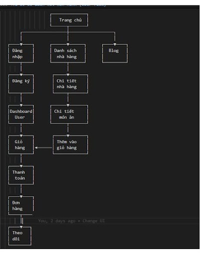
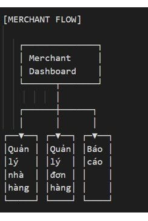
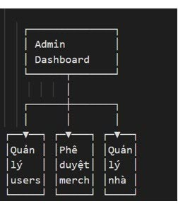
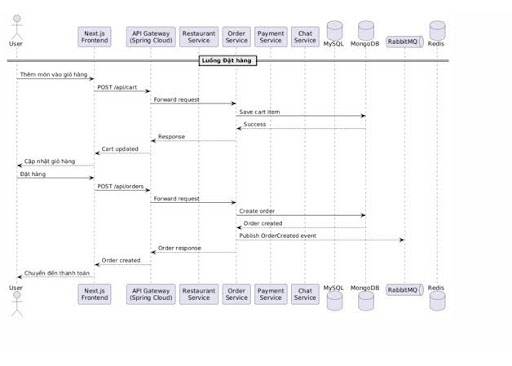
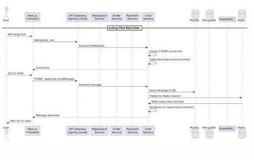
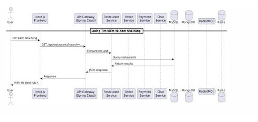
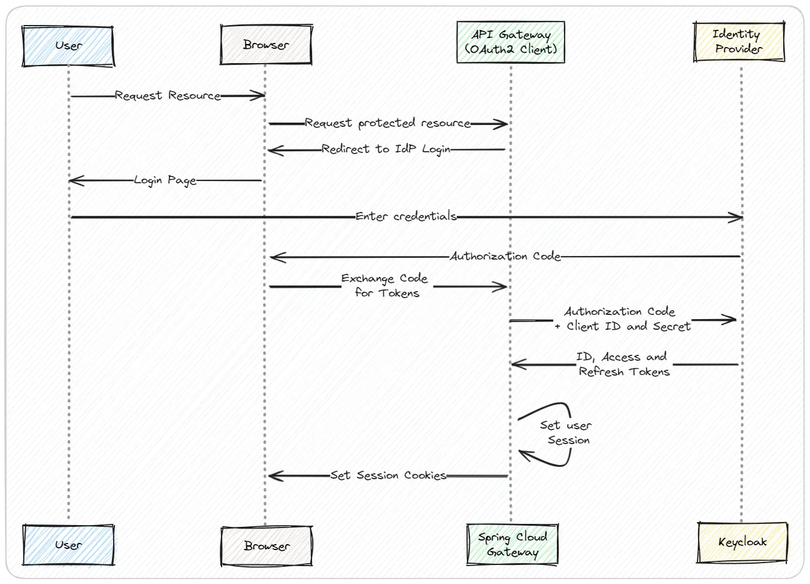

# IE303-Restaurant

Nền tảng đặt món nhà hàng theo kiến trúc microservices, gồm backend Spring Boot đa dịch vụ, frontend Next.js, xác thực Keycloak, message broker RabbitMQ, cache Redis, cùng bộ quan sát Prometheus + Grafana + Zipkin.

## 1. Tổng quan kiến trúc

- Frontend: Next.js (App Router), React, TypeScript.
- API Gateway: định tuyến request từ frontend đến các service backend.
- Service Discovery: Eureka để các service đăng ký và tìm nhau.
- AuthN/AuthZ: Keycloak (realm, role, OAuth2/OIDC).
- Dữ liệu:
	- PostgreSQL + PostGIS cho phần lớn nghiệp vụ.
	- MongoDB cho order-service.
	- Redis cho cache/session/realtime hỗ trợ.
- Message Broker: RabbitMQ cho giao tiếp bất đồng bộ.
- Observability:
	- Zipkin cho tracing.
	- Prometheus cho metrics.
	- Grafana cho dashboard.
- Reverse Proxy/TLS: Caddy.

## 2. Cấu trúc thư mục chính

```text
.
├─ backend/                     # Hệ microservices Java (Gradle multi-module)
│  ├─ api-gateway/
│  ├─ service-discovery/
│  ├─ user-service/
│  ├─ notification-service/
│  ├─ chat-service/
│  ├─ recommendation-service/
│  ├─ restaurant-service/
│  ├─ dashboard-service/
│  ├─ order-service/
│  ├─ blog-service/
│  ├─ payment-service/
│  ├─ Common/
│  └─ seed-db/                  # SQL seed dữ liệu ban đầu
├─ frontend/                    # Next.js frontend (client/merchant/admin)
├─ keycloak-config/             # Realm, theme, script init/role
├─ caddy/                       # Caddyfile cho local/prod
├─ monitoring/                  # Prometheus + Grafana provisioning
├─ deploy/                      # Script build/push/deploy production
├─ docker-compose.dev.yml       # Infra dev (keycloak/rabbitmq/redis/...)
├─ docker-compose.yml           # Stack đầy đủ local bằng Docker
├─ docker.sh                    # Script up/down dev infra
├─ start.sh                     # Chạy nhanh 1 backend module bằng Gradle
└─ spot.sh                      # Format Java code (Spotless)
```

## 3. Chức năng từng backend service

### 3.1. Hạ tầng lõi

- service-discovery:
	- Chạy Eureka Server để toàn bộ service đăng ký và tìm nhau.
	- Là dependency khởi động sớm cho gateway và hầu hết service nghiệp vụ.
- api-gateway:
	- Điểm vào thống nhất cho frontend/client.
	- Xử lý bảo mật OAuth2 Resource Server, chuyển role từ JWT (Keycloak), định tuyến về service đích.
	- Public một số route đặc thù như register user, webhook payment, SSE.
- Common:
	- Module thư viện dùng chung cho DTO/event/contract liên service.
	- Hiện dùng rõ cho contract sự kiện thông báo đơn hàng qua RabbitMQ.

### 3.2. Nhóm service nghiệp vụ chính

- user-service:
	- Quản lý hồ sơ người dùng, địa chỉ, truy vấn user theo vai trò.
	- Hỗ trợ luồng đăng ký và đồng bộ user với Keycloak.
	- Endpoint chính: /api/users/*.
- restaurant-service:
	- Quản lý nhà hàng (CRUD), tìm kiếm/lọc và logic vị trí địa lý.
	- Hỗ trợ upload media phục vụ nghiệp vụ merchant.
	- Endpoint chính: /api/restaurant/*.
- order-service:
	- Xử lý checkout, tạo đơn, truy vấn đơn theo user/merchant/restaurant.
	- Cập nhật trạng thái đơn và phát sự kiện thông báo.
	- Endpoint chính: /api/order/*.
- payment-service:
	- Tạo payment link cho đơn hàng và nhận webhook từ cổng thanh toán (PayOS).
	- Tách riêng domain thanh toán khỏi order-service.
	- Endpoint chính: /api/payments/create, /api/payments/webhook.
- notification-service:
	- Nhận event từ RabbitMQ để gửi thông báo theo thời gian thực (SSE) và email.
	- Tập trung cho luồng cập nhật trạng thái đơn hàng.
- chat-service:
	- Quản lý hội thoại, room, lịch sử chat giữa user, merchant, admin.
	- Cung cấp API room/tin nhắn, phân trang và thao tác trạng thái.
	- Endpoint chính: /api/chat/*.
- recommendation-service:
	- Gợi ý món ăn theo ngữ cảnh và tâm trạng.
	- Sinh mô tả món ăn, tóm tắt review bằng AI.
	- Endpoint chính: /api/recommendations/**.
- dashboard-service:
	- Cung cấp dữ liệu tổng hợp cho dashboard admin/merchant.
	- Bao gồm overview, doanh thu theo kỳ, thống kê đơn và báo cáo.
	- Endpoint chính: /api/dashboard/*.
- blog-service:
	- Quản lý bài viết (draft/published/archived), upload ảnh, đọc công khai theo slug.
	- Endpoint chính: /api/blogs/*.

### 3.3. Trạng thái Docker hóa module

- Có Dockerfile sẵn trong backend/: api-gateway, service-discovery, user-service, notification-service, chat-service, restaurant-service, dashboard-service, recommendation-service, order-service.
- Chưa có Dockerfile trong backend/ ở trạng thái hiện tại: blog-service, payment-service.

## 4. Một số flow nghiệp vụ (docs/images)

Các flow dưới đây lấy trực tiếp từ thư mục docs/images.

### 4.1. User flow



### 4.2. Merchant flow



### 4.3. Admin flow



### 4.4. Order flow



### 4.5. Chat flow



### 4.6. Restaurant flow



### 4.7. OIDC authentication flow

Flow này mô tả luồng đăng nhập OIDC (Authorization Code + PKCE) giữa frontend, Keycloak và backend.



## 5. Yêu cầu môi trường

- Docker + Docker Compose
- Java 21 (theo toolchain của backend)
- Node.js 20+ và npm (cho frontend local)
- Bash shell (Linux/macOS/WSL)

## 6. Cấu hình biến môi trường

Project dùng file .env ở thư mục gốc.

1. Tạo file cấu hình:

```bash
cp .env.example .env
```

2. Điền các biến bắt buộc trong .env, đặc biệt:

- Hạ tầng: DB_PASSWORD, REDIS_*, RABBITMQ_*, MONGO_*
- Keycloak/OAuth: KEYCLOAK_*, BACKEND_CLIENT_*, JWT_ISSUER_URI
- Service ports: SERVICE_DISCOVERY_PORT, API_GATEWAY_PORT, USER_PORT, ...
- Frontend public vars: NEXT_PUBLIC_API_URL, NEXT_PUBLIC_BACKEND_ORIGIN, NEXT_PUBLIC_KEYCLOAK_*
- Monitoring/security: GF_SECURITY_ADMIN_*, CADDY_HASH_PASSWORD

## 7. Chạy local (khuyến nghị cho dev)

### Cách A: Chạy infra bằng Docker, chạy app bằng local process

Phù hợp khi bạn muốn debug backend/frontend trực tiếp.

1. Khởi động hạ tầng phụ trợ:

```bash
./docker.sh up
```

Script sẽ:

- chạy docker-compose.dev.yml
- đợi Keycloak ready
- chạy role-management cho realm

2. Chạy backend module cần làm việc:

```bash
./start.sh service-discovery
./start.sh api-gateway
./start.sh user-service
```

Bạn có thể mở nhiều terminal và chạy mỗi service ở một terminal.

3. Chạy frontend:

```bash
cd frontend
npm install
npm run dev
```

4. Dừng hạ tầng dev:

```bash
./docker.sh down
```

### Cách B: Chạy full stack bằng Docker

Phù hợp khi cần dựng nhanh gần production tại local.

```bash
docker compose up -d --build
```

Dừng toàn bộ:

```bash
docker compose down -v
```

## 8. Các URL hữu ích khi chạy dev

Theo docker-compose.dev.yml:

- Keycloak: http://localhost:9090/auth
- RabbitMQ UI: http://localhost:15672
- Redis: localhost:6379
- Zipkin: http://localhost:9411
- Prometheus: http://localhost:9000
- Grafana: http://localhost:3030
- Ngrok Inspector: http://localhost:4040

Theo docker-compose.yml (full stack):

- Caddy entrypoint: https://localhost:8443
- Các dịch vụ nội bộ expose qua Caddy/API Gateway tùy route cấu hình.

## 9. Build, format, quality

Từ thư mục gốc:

```bash
./spot.sh
```

Từ thư mục backend:

```bash
./gradlew clean build
./gradlew test
```

Từ thư mục frontend:

```bash
npm run lint
npm run build
npm run validate
```

## 10. Triển khai production

Thư mục deploy/ chứa luồng build & deploy:

- deploy.sh: build/push image lên GHCR theo version semver, upload cấu hình và cập nhật máy chủ.
- docker-compose.prod.yml: stack production dùng image từ registry.
- update-containers.sh: script update service ở host deploy.

Ví dụ:

```bash
cd deploy
bash deploy.sh 1.0.0
```

Lưu ý:

- Cần chuẩn bị sẵn file bí mật/chứng thực (ví dụ ghcr.pem, key.pem, .env).
- Kiểm tra chính xác host, username, key và đường dẫn remote trước khi deploy thật.

## 11. Gợi ý thứ tự khởi động backend local

Khi chạy từng service bằng ./start.sh, nên theo thứ tự:

1. service-discovery
2. api-gateway
3. các service lõi (user/restaurant/chat/recommendation/notification/dashboard/order/blog/payment)
4. frontend
